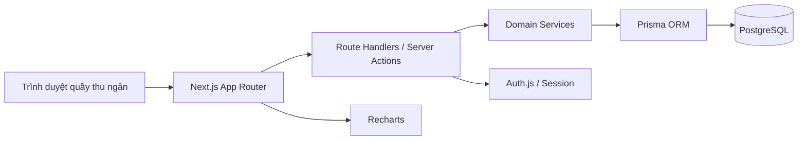
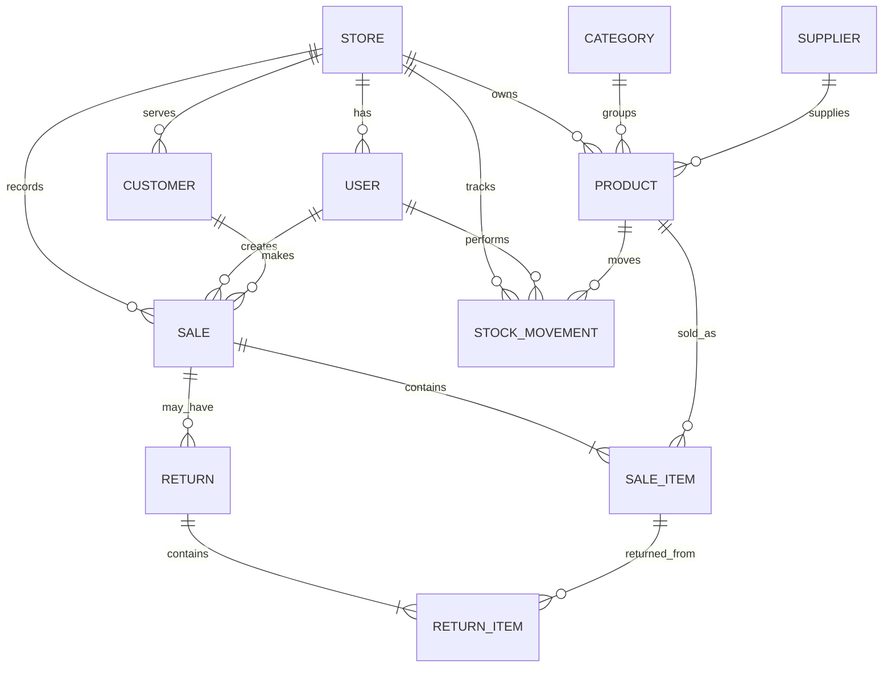

# Kiến trúc hệ thống: MyShop

**Sản phẩm:** MyShop - Hệ thống quản lý cửa hàng tạp hóa
**Phiên bản:** MVP 1.0
**Ngôn ngữ tài liệu:** Tiếng Việt
**Trạng thái:** Đề xuất kiến trúc

## 1. Quyết định kiến trúc tổng thể

MyShop sử dụng kiến trúc **modular monolith full-stack**. Frontend, API và nghiệp vụ nằm trong một ứng dụng Next.js; dữ liệu được lưu trong PostgreSQL và truy cập qua Prisma.

Lựa chọn này phù hợp với một cửa hàng duy nhất vì:

- Triển khai và vận hành đơn giản.
- Không cần quản lý nhiều service hoặc message broker trong MVP.
- Transaction database bảo đảm bán hàng và tồn kho cập nhật nhất quán.
- Có ranh giới module rõ ràng để tách service sau này nếu quy mô tăng.



## 2. Tech Stack

| Lớp | Công nghệ | Lý do |
|---|---|---|
| Ngôn ngữ | TypeScript | Kiểm tra kiểu xuyên suốt frontend và backend |
| Runtime | Node.js LTS | Hệ sinh thái ổn định, dễ triển khai |
| Framework | Next.js 15+ App Router | Full-stack trong một ứng dụng, routing và server rendering tích hợp |
| UI | React 19 | Phù hợp với dashboard và các form tương tác |
| Styling | Tailwind CSS | Xây dựng nhanh design token dark cybernetic và responsive layout |
| Component | Radix UI primitives + component nội bộ | Accessibility tốt, kiểm soát được visual style |
| Icon | Lucide React | Icon nhất quán cho thao tác nghiệp vụ |
| Form | React Hook Form + Zod | Validation phía client và server dùng chung schema |
| State server | TanStack Query | Cache, invalidation và trạng thái loading/error rõ ràng |
| State cục bộ | React state | Đủ cho giỏ hàng và inspector; tránh global store khi chưa cần |
| Biểu đồ | Recharts | Biểu đồ doanh thu đơn giản, hỗ trợ responsive |
| API | Next.js Route Handlers | API nội bộ rõ ràng, không cần service riêng trong MVP |
| ORM | Prisma | Schema migration, type-safe query và transaction |
| Database | PostgreSQL 16+ | Transaction, constraint và query báo cáo đáng tin cậy |
| Xác thực | Auth.js | Session và password login cho owner/cashier |
| Mật khẩu | Argon2id | Băm mật khẩu chống brute-force tốt |
| Kiểm thử | Vitest, Testing Library, Playwright | Unit, component và E2E cho luồng bán hàng |
| Lint/format | ESLint + Prettier | Giữ chất lượng và format nhất quán |
| Package manager | pnpm | Cài đặt nhanh và lockfile ổn định |

### 2.1. Không dùng trong MVP

- Microservices.
- Redis hoặc message queue.
- Elasticsearch.
- Native mobile app.
- Payment gateway bên ngoài.
- Offline-first sync phức tạp.

## 3. Cấu trúc thư mục code

```text
MyShop/
├── app/
│   ├── (auth)/
│   │   └── login/
│   │       └── page.tsx
│   ├── (dashboard)/
│   │   ├── layout.tsx
│   │   ├── dashboard/page.tsx
│   │   ├── sales/page.tsx
│   │   ├── products/page.tsx
│   │   ├── inventory/page.tsx
│   │   ├── customers/page.tsx
│   │   ├── reports/page.tsx
│   │   └── settings/page.tsx
│   ├── api/
│   │   ├── auth/[...nextauth]/route.ts
│   │   ├── dashboard/route.ts
│   │   ├── products/route.ts
│   │   ├── inventory/route.ts
│   │   ├── sales/route.ts
│   │   ├── sales/[id]/return/route.ts
│   │   ├── customers/route.ts
│   │   └── reports/route.ts
│   ├── layout.tsx
│   ├── globals.css
│   └── page.tsx
├── components/
│   ├── layout/
│   │   ├── app-shell.tsx
│   │   ├── top-telemetry-bar.tsx
│   │   ├── side-navigation.tsx
│   │   ├── bottom-action-bar.tsx
│   │   └── inspector-panel.tsx
│   ├── dashboard/
│   │   ├── metric-strip.tsx
│   │   ├── operations-flow.tsx
│   │   ├── revenue-chart.tsx
│   │   ├── low-stock-table.tsx
│   │   └── recent-sales-table.tsx
│   ├── sales/
│   │   ├── sales-console.tsx
│   │   ├── product-search.tsx
│   │   ├── cart.tsx
│   │   ├── payment-selector.tsx
│   │   └── receipt-view.tsx
│   ├── products/
│   ├── inventory/
│   ├── customers/
│   ├── reports/
│   └── ui/
├── domain/
│   ├── auth/
│   │   ├── permissions.ts
│   │   └── session.ts
│   ├── products/
│   │   ├── product.schema.ts
│   │   ├── product.service.ts
│   │   └── product.repository.ts
│   ├── inventory/
│   │   ├── inventory.schema.ts
│   │   ├── inventory.service.ts
│   │   └── inventory.repository.ts
│   ├── sales/
│   │   ├── sale.schema.ts
│   │   ├── sale.service.ts
│   │   ├── sale.repository.ts
│   │   └── return.service.ts
│   ├── customers/
│   ├── reports/
│   └── shared/
│       ├── money.ts
│       ├── pagination.ts
│       └── errors.ts
├── lib/
│   ├── db.ts
│   ├── auth.ts
│   ├── logger.ts
│   └── api-response.ts
├── prisma/
│   ├── schema.prisma
│   ├── seed.ts
│   └── migrations/
├── tests/
│   ├── unit/
│   ├── integration/
│   └── e2e/
├── public/
├── .env.example
├── next.config.ts
├── tailwind.config.ts
├── tsconfig.json
├── package.json
└── README.md
```

### 3.1. Quy tắc phụ thuộc

- `app/` chỉ điều phối request, layout và render; không chứa quy tắc nghiệp vụ phức tạp.
- `components/` không truy cập database trực tiếp.
- `domain/` chứa validation, nghiệp vụ và repository của từng module.
- `lib/db.ts` là điểm tạo Prisma client duy nhất.
- Route handler gọi service, service gọi repository.
- `domain/shared/money.ts` dùng integer đơn vị tiền nhỏ nhất, không dùng floating point.
- Không xóa cứng dữ liệu đã xuất hiện trong giao dịch.

## 4. Thiết kế module nghiệp vụ

### 4.1. Auth và phân quyền

- `OWNER`: toàn quyền trong cửa hàng, bao gồm sản phẩm, giá vốn, tồn kho, báo cáo và người dùng.
- `CASHIER`: bán hàng, xem sản phẩm, xem tồn khả dụng, tạo khách hàng và xử lý thao tác được cấp quyền.
- Kiểm tra quyền ở server, không chỉ ẩn nút trên UI.

### 4.2. Product

Chịu trách nhiệm danh mục, sản phẩm, mã vạch, giá và trạng thái hoạt động. Product service không tự thay đổi tồn kho; mọi thay đổi tồn phải đi qua Inventory service.

### 4.3. Inventory

Chịu trách nhiệm số lượng tồn và lịch sử biến động. Các loại biến động:

- `PURCHASE`: nhập hàng.
- `SALE`: xuất do bán hàng.
- `RETURN`: hoàn lại do trả hàng.
- `ADJUSTMENT_IN`: điều chỉnh tăng.
- `ADJUSTMENT_OUT`: điều chỉnh giảm.

### 4.4. Sales

Chịu trách nhiệm giỏ hàng, giao dịch, dòng sản phẩm, thanh toán và biên lai. Giá bán và giá vốn phải được snapshot ở `SaleItem` để báo cáo lịch sử không bị thay đổi khi sản phẩm đổi giá.

### 4.5. Reports

Chỉ đọc dữ liệu từ các bảng giao dịch đã hoàn tất và biến động tồn. Báo cáo MVP dùng query PostgreSQL có index; chưa cần data warehouse.

## 5. Thiết kế database PostgreSQL

### 5.1. Sơ đồ quan hệ



### 5.2. Các bảng chính

#### `stores`

- `id` UUID, khóa chính.
- `name` VARCHAR(120), bắt buộc.
- `currency_code` CHAR(3), bắt buộc.
- `tax_rate_basis_points` INTEGER, mặc định 0.
- `created_at`, `updated_at` TIMESTAMPTZ.

#### `users`

- `id` UUID, khóa chính.
- `store_id` UUID, khóa ngoại.
- `name` VARCHAR(120).
- `email` VARCHAR(255), unique trong store.
- `password_hash` TEXT.
- `role` ENUM `OWNER | CASHIER`.
- `is_active` BOOLEAN.
- `created_at`, `updated_at`.

#### `categories`

- `id` UUID, khóa chính.
- `store_id` UUID, khóa ngoại.
- `name` VARCHAR(100).
- Unique `(store_id, name)`.

#### `suppliers`

- `id` UUID, khóa chính.
- `store_id` UUID, khóa ngoại.
- `name` VARCHAR(160).
- `phone` VARCHAR(30), nullable.
- `is_active` BOOLEAN.

#### `products`

- `id` UUID, khóa chính.
- `store_id` UUID, khóa ngoại.
- `category_id` UUID, nullable.
- `supplier_id` UUID, nullable.
- `name` VARCHAR(180), bắt buộc.
- `barcode` VARCHAR(80), nullable.
- `unit` ENUM `PIECE | PACK | BOTTLE | BOX`.
- `cost_price_minor` BIGINT.
- `selling_price_minor` BIGINT.
- `current_quantity` INTEGER, không âm.
- `minimum_quantity` INTEGER, không âm.
- `expiry_date` DATE, nullable.
- `is_active` BOOLEAN.
- `created_at`, `updated_at`.
- Unique `(store_id, barcode)` khi barcode không null.
- Index `(store_id, name)` và `(store_id, current_quantity)`.

#### `customers`

- `id` UUID, khóa chính.
- `store_id` UUID, khóa ngoại.
- `name` VARCHAR(160).
- `phone` VARCHAR(30), nullable.
- `created_at`, `updated_at`.
- Index `(store_id, name)` và `(store_id, phone)`.

#### `sales`

- `id` UUID, khóa chính.
- `store_id` UUID, khóa ngoại.
- `receipt_number` VARCHAR(40), unique trong store.
- `customer_id` UUID, nullable.
- `created_by_id` UUID, khóa ngoại tới users.
- `status` ENUM `COMPLETED | CANCELLED | PARTIALLY_RETURNED | RETURNED`.
- `payment_method` ENUM `CASH | CARD | MOBILE`.
- `subtotal_minor` BIGINT.
- `discount_minor` BIGINT, mặc định 0.
- `tax_minor` BIGINT, mặc định 0.
- `total_minor` BIGINT.
- `completed_at` TIMESTAMPTZ, nullable.
- `created_at`, `updated_at`.
- Index `(store_id, completed_at)` và `(store_id, status)`.

#### `sale_items`

- `id` UUID, khóa chính.
- `sale_id` UUID, khóa ngoại.
- `product_id` UUID, khóa ngoại.
- `product_name_snapshot` VARCHAR(180).
- `unit_snapshot` VARCHAR(20).
- `cost_price_minor` BIGINT.
- `selling_price_minor` BIGINT.
- `quantity` INTEGER, lớn hơn 0.
- `discount_minor` BIGINT, mặc định 0.
- `line_total_minor` BIGINT.
- Index `(product_id, sale_id)`.

#### `stock_movements`

- `id` UUID, khóa chính.
- `store_id` UUID, khóa ngoại.
- `product_id` UUID, khóa ngoại.
- `performed_by_id` UUID, khóa ngoại tới users.
- `sale_id` UUID, nullable.
- `type` ENUM `PURCHASE | SALE | RETURN | ADJUSTMENT_IN | ADJUSTMENT_OUT`.
- `quantity_delta` INTEGER, khác 0.
- `quantity_before` INTEGER.
- `quantity_after` INTEGER.
- `reason` VARCHAR(255), nullable.
- `created_at` TIMESTAMPTZ.
- Index `(store_id, created_at)` và `(product_id, created_at)`.

#### `returns`

- `id` UUID, khóa chính.
- `store_id` UUID, khóa ngoại.
- `sale_id` UUID, khóa ngoại.
- `processed_by_id` UUID, khóa ngoại.
- `reason` VARCHAR(255).
- `total_minor` BIGINT.
- `created_at` TIMESTAMPTZ.

#### `return_items`

- `id` UUID, khóa chính.
- `return_id` UUID, khóa ngoại.
- `sale_item_id` UUID, khóa ngoại.
- `quantity` INTEGER, lớn hơn 0.
- `line_total_minor` BIGINT.

#### `audit_logs`

- `id` UUID, khóa chính.
- `store_id` UUID, khóa ngoại.
- `user_id` UUID, khóa ngoại.
- `action` VARCHAR(80).
- `entity_type` VARCHAR(80).
- `entity_id` UUID.
- `metadata` JSONB.
- `created_at` TIMESTAMPTZ.
- Index `(store_id, created_at)` và `(entity_type, entity_id)`.

## 6. Transaction và tính nhất quán tồn kho

### 6.1. Hoàn tất bán hàng

`SaleService.completeSale()` phải thực hiện trong một Prisma transaction:

1. Validate payload bằng Zod.
2. Khóa các product rows liên quan bằng query raw `FOR UPDATE`.
3. Đọc lại giá và tồn kho từ database, không tin giá/tồn từ client.
4. Kiểm tra sản phẩm còn active và số lượng đủ.
5. Tạo `Sale` và `SaleItem` với snapshot giá.
6. Cập nhật `products.current_quantity`.
7. Tạo `StockMovement` loại `SALE` cho từng sản phẩm.
8. Tạo audit log.
9. Commit; nếu bất kỳ bước nào lỗi thì rollback toàn bộ.

### 6.2. Nhập hoặc điều chỉnh tồn

- Dùng transaction và row lock.
- Tính `quantity_after = quantity_before + quantity_delta`.
- Từ chối nếu `quantity_after < 0`.
- Luôn lưu `quantity_before` và `quantity_after` để kiểm toán.

### 6.3. Trả hàng

- Khóa sale và sale items.
- Kiểm tra số lượng đã trả trước đó.
- Tạo `Return` và `ReturnItem`.
- Tăng tồn kho và tạo `StockMovement` loại `RETURN` trong cùng transaction.
- Cập nhật trạng thái sale.

## 7. API contract mức cao

| Method | Endpoint | Quyền | Mục đích |
|---|---|---|---|
| `GET` | `/api/dashboard?period=today` | Owner, Cashier | KPI và cảnh báo |
| `GET/POST` | `/api/products` | Owner / cả hai xem | Danh sách hoặc tạo sản phẩm |
| `PATCH` | `/api/products/:id` | Owner | Sửa hoặc ngừng bán |
| `GET/POST` | `/api/inventory` | Owner | Xem hoặc nhập/điều chỉnh tồn |
| `GET/POST` | `/api/sales` | Owner, Cashier | Tạo nháp hoặc hoàn tất bán |
| `POST` | `/api/sales/:id/return` | Theo policy | Tạo trả hàng |
| `GET/POST` | `/api/customers` | Owner, Cashier | Tra cứu hoặc tạo khách hàng |
| `GET` | `/api/reports?from=&to=` | Owner | Báo cáo |

Response lỗi thống nhất:

```json
{
  "error": {
    "code": "INSUFFICIENT_STOCK",
    "message": "Sản phẩm không đủ số lượng tồn.",
    "details": { "productId": "...", "available": 2, "requested": 4 }
  }
}
```

## 8. Bảo mật

- Session cookie `HttpOnly`, `Secure` ở production và `SameSite=Lax`.
- Mọi endpoint xác thực `store_id` từ session, không nhận store tùy ý từ client.
- Zod validate mọi request body.
- Prisma parameterized queries; không nối chuỗi SQL từ input.
- Rate limit login và ghi log các thao tác nhạy cảm.
- Không ghi password, session token hoặc dữ liệu nhạy cảm vào log.
- Owner mới được xem `audit_logs` và dữ liệu JSON thô.

## 9. Triển khai và môi trường

### Môi trường

- `development`: Next.js local + PostgreSQL Docker.
- `test`: database riêng, migrate sạch trước suite integration.
- `production`: Next.js Node runtime + PostgreSQL managed.

### Biến môi trường

```text
DATABASE_URL=
AUTH_SECRET=
APP_URL=
LOG_LEVEL=info
```

### Backup

- PostgreSQL backup tự động hằng ngày.
- Kiểm tra khôi phục định kỳ.
- Migration chạy trước khi ứng dụng production nhận traffic.

## 10. Chiến lược kiểm thử

- Unit: money calculation, low-stock rule, permission rule, report calculations.
- Integration: complete sale, insufficient stock rollback, stock adjustment, return flow.
- Component: cart, payment selector, inspector, validation states.
- E2E: login -> tạo sản phẩm -> nhập kho -> bán hàng -> kiểm tra dashboard -> trả hàng.
- Regression bắt buộc: giao dịch hoàn tất không được làm tồn âm hoặc tạo movement thiếu.

## 11. Rủi ro và phương án giảm thiểu

| Rủi ro | Giảm thiểu |
|---|---|
| Tồn kho lệch khi hai thao tác bán cùng sản phẩm | Row lock + transaction + integration test cạnh tranh |
| Làm tròn tiền | Lưu integer minor units, không dùng float |
| Barcode trùng | Unique constraint theo store và hiển thị lỗi tại form |
| Cashier sửa dữ liệu nhạy cảm | Server-side authorization và audit log |
| Dashboard chậm khi dữ liệu tăng | Index theo store/time, query aggregate rõ ràng |
| Mất kết nối lúc thanh toán | Idempotency key, trạng thái xử lý rõ ràng, không hiển thị thành công giả |

## 12. Thứ tự triển khai đề xuất

1. Khởi tạo Next.js, TypeScript, Tailwind, Prisma và PostgreSQL.
2. Tạo schema, migration, seed và authentication.
3. Xây domain product/category và inventory movement.
4. Xây sales transaction với transaction/row lock.
5. Xây dashboard và reports từ dữ liệu thật.
6. Xây customer và return flow.
7. Hoàn thiện visual system, inspector, responsive và keyboard flow.
8. Chạy E2E, kiểm tra backup và chuẩn bị deploy.

## 13. Quyết định cần xác nhận trước khi code

- Currency code mặc định của cửa hàng.
- Quy tắc thuế: có thuế hay không, mức thuế và cách làm tròn.
- Biên lai: in, tải xuống hay chỉ hiển thị.
- Có bật theo dõi ngày hết hạn trong MVP hay chỉ lưu trường dữ liệu.
- Chính sách trả hàng và quyền của thu ngân.
- Nhà cung cấp có cần màn hình quản lý riêng hay chỉ là trường trên sản phẩm.
